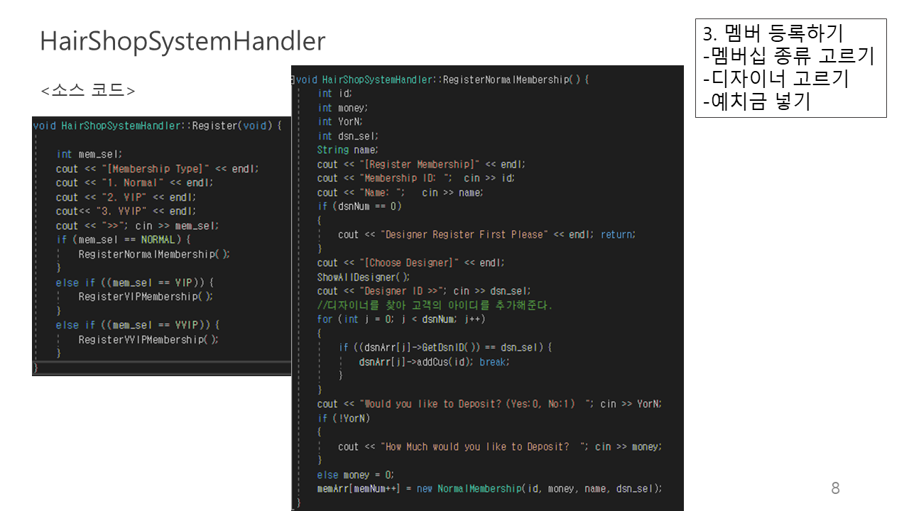

# HairShopSystem
이 프로젝트는 2019년 11월 객체지향 프로그래밍 수업에서 기말 프로젝트로 진행했던 개인 프로젝트 입니다.
프로그래밍 언어는 C++를 사용하였습니다.
직원과 고객을 관리하는 기본적인 시스템이며, 헤어샵을 주제로 선정해 보았습니다.

#### 가정
- 급여, 비용 등 모두 정수로 처리된다.
- 아이디 중복은 입력하지 않는다.

### 프로그램 설명
- 고객과 디자이너를 독립적으로 관리할 수 있다.
- 중재자를 통해 고객과 디자이너 사이를 연결할 수 있다. 

### 기능
<b>멤버</b>
- 멤버십에 등록하기 (Normal, VIP, VVIP의 단계로 구분하고 예치금의 금액과 할인율이 각각 다르게 적용된다.)
- 어떤 서비스를 받았는지 과거의 이력 열람하기
- 
<b>헤어 디자이너</b>
- 디자이너 등록하기
- 자신이 어떤 손님에게 어떤 서비스를 제공하였는지 이력 열람하기
- 자신의 손님 등록하기

<b>중재자 HairshopSystemHandler</b>
- 메뉴 보여주기
- 등록하기
- 예치금 넣기
- 머리 하기 (커트, 염색, 파마로 분류)
- 멤버십, 디자이너 등록하기
- 모든 멤버, 디자이너 정보 열람하기

### 클래스 구조

### 클래스 멤버 변수 및 메소드

### 소스코드와 실행 화면 예시

